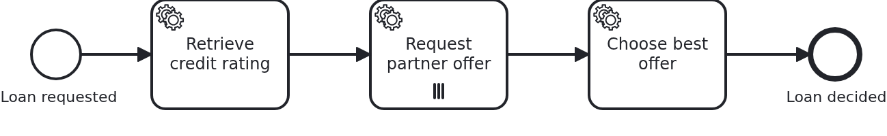

# Multi-instance tasks

[](./LICENSE)

Sometimes a task has to run once per something: per partner asked, per document to check, per
customer to inform. A multi-instance task is how the model says so, and this blueprint shows
what the business code sees of it, which is one element at a time.

## What this blueprint shows



The loan approval of the base blueprint asks several partner banks for an offer, one
instance of the task per partner, and takes the cheapest one afterwards.

The BPMS hands three things to a `@WorkflowTask` method, and each of them names the
multi-instance element in the model:

```java
@WorkflowTask
public void requestPartnerOffer(
    final Aggregate loanApproval,
    @MultiInstanceElement("ServiceTask_RequestPartnerOffer") final String partnerId,
    @MultiInstanceIndex("ServiceTask_RequestPartnerOffer") final int index,
    @MultiInstanceTotal("ServiceTask_RequestPartnerOffer") final int total) {
```

The name is the ID of the multi-instance element rather than the name of the element
variable in the model, and it has to be given: a method may sit inside several iterations at
once, a multi-instance task within a multi-instance subprocess, and then it matters which of
them a parameter asks about.

What is iterated over comes from the workflow aggregate. The model reads the attribute
`partnerIds`, the business code fills it before the task is reached, and no process variable
holds a copy of it. Keep such a collection to identifiers: the engine hands one element to
each instance, an identifier is the smallest thing which does that, and the business code
looks up whatever else it needs.

Every instance is a token of its own, and a remote engine really does run them next to each
other. Each of them loads the workflow aggregate, runs the method and saves it again, so an
attribute written by all of them would end up holding what the instance committing last read
at its start. This blueprint therefore adds a row per offer, `PartnerOffer`, which is a
modelling decision rather than a JPA trick: an offer of one partner is a thing of its own and
several of them do not compete. The other ways out are in the wiki under
[Workflow aggregates](https://github.com/vanillabp/adapter-platform-integration/wiki/Workflow-aggregates).

Anything computed over all iterations belongs after the multi-instance task. `chooseBestOffer`
is a plain service task which runs once, when the last instance has finished, and it reads the
rows the iterations left.

## Delta to the base blueprint

Compared to [`module-single`](https://github.com/vanillabp-blueprints/module-single-springboot):

|            File            |                                        What is different                                        |
|----------------------------|-------------------------------------------------------------------------------------------------|
| `loan_approval.bpmn`       | a multi-instance service task iterating over an attribute of the aggregate, and a task after it |
| `Aggregate.java`           | `partnerIds`, which the model iterates over, and `offers`, one row per iteration                |
| `PartnerOffer.java`        | new: what one iteration found                                                                   |
| `WorkflowTaskHandler.java` | `@MultiInstanceElement`, `@MultiInstanceIndex` and `@MultiInstanceTotal`                        |
| `Service.java`             | a method taking ONE partner, and a second one choosing between the results                      |
| `loan-approval.yaml`       | the partners, which is what decides how many iterations there are                               |
| `LoanApprovalIT.java`      | asserts the rows of all iterations, without relying on the order they arrived in                |

## Running it

Requires a JDK 21. Camunda 7 is embedded, so nothing else has to run:

```bash
mvn install verify
```

Running it on another BPMS is a Maven profile, not one line of Java changes:

```bash
mvn install verify -Pcamunda8
```

Camunda 8 is a remote engine, so a cluster has to run and be pointed at. Start one, then
add its address to `application/src/main/resources/application.yaml` and to
`loan-approval/src/test/resources/application.yaml`:

```yaml
vanillabp:
  adapters:
    camunda8:
      rest-address: http://localhost:8080
      # Nothing else is needed: this adapter keeps workflow modules apart by nothing at all
      # ('name-clash-avoidance: none') unless told otherwise, because a cluster started from
      # the stock image has multi-tenancy switched off and rejects a tenant per module. The
      # adapter warns about it while booting - with one workflow module the identifiers are
      # unique anyway. Set 'name-clash-avoidance: use-prefix' to have VanillaBP prefix them.
```

That engine has no loop cardinality and reports neither the number of instances nor, to a
nested task, the iteration around it. The adapter fills those gaps while deploying, so the
same Java code and the same annotations work here; the
[adapter's wiki](https://github.com/camunda-community-hub/vanillabp-camunda8-adapter/wiki/Deviations)
says what it does.

Start the application:

```bash
mvn -pl application spring-boot:run
```

Booting logs a warning per workflow module: the adapter starts out with
`name-clash-avoidance: none`, so nothing keeps the identifiers of one workflow module apart
from those of another, and it asks for a decision instead of picking one. One module cannot
collide with itself, so this blueprint leaves it at that. Answering the question is one
property, `vanillabp.adapters.<id>.accept-unscoped-identifiers: true`, and the modes a BPMS
offers are in
[the wiki](https://github.com/vanillabp/adapter-platform-integration/wiki/Workflow-modules#how-name-clashes-are-avoided).

This is the URL that starts a loan approval:

```
http://localhost:8080/api/loan-approval/start?amount=5000
```

The log shows one line per iteration, and the choice made afterwards:

```
Loan approval '383f…' started
Credit rating of loan approval '383f…' is 50, asking 3 partner(s)
Asking partner 1 of 3 for loan approval '383f…'
Partner 'northern-bank' offers 95 basis points for loan approval '383f…'
Asking partner 2 of 3 for loan approval '383f…'
Partner 'harbour-credit' offers 70 basis points for loan approval '383f…'
Asking partner 3 of 3 for loan approval '383f…'
Partner 'alpine-savings' offers 85 basis points for loan approval '383f…'
Loan approval '383f…' takes the offer of 'harbour-credit' at 70 basis points, out of 3 offer(s)
```

The result of a run is at

```
http://localhost:8080/api/loan-approval/{loanRequestId}
```

Add a partner to `loan-approval/src/main/resources/loan-approval/loan-approval.yaml` and the
task runs four times instead of three, without the model being touched and without a
deployment. That is the reason the list lives in configuration.

While the application runs on Camunda 7, Camunda's own web applications are served at

```
http://localhost:8080/camunda
```

Log in with `demo` / `demo`. Cockpit draws the multi-instance task with the number of
instances that ran, which is the quickest way to see an iteration from the outside. The user
comes from `application/src/main/camunda7/resources/camunda7-webapps.yaml` and exists so that
the blueprint can be operated without setting one up; an application with an identity provider
of its own leaves that section out.

## How it works

|                                            File                                            |                                      Role                                      |
|--------------------------------------------------------------------------------------------|--------------------------------------------------------------------------------|
| `loan-approval/src/main/resources/loan-approval/processes/<adapter-id>/loan_approval.bpmn` | the multi-instance task, what it iterates over and what each instance is given |
| `.../loanapproval/WorkflowTaskHandler.java`                                                | turns the element, the index and the total into a call naming one partner      |
| `.../loanapproval/Service.java`                                                            | asks one partner, and picks the best offer once all of them answered           |
| `.../loanapproval/model/Aggregate.java`                                                    | the collection the model iterates over, and the offers written into it         |
| `.../loanapproval/model/PartnerOffer.java`                                                 | one row per iteration, which is what makes concurrent instances harmless       |
| `loan-approval/src/main/resources/loan-approval/loan-approval.yaml`                        | the partners, so the number of iterations is configuration rather than model   |
| `loan-approval/src/test/.../LoanApprovalIT.java`                                           | asserts the rows of all iterations and the choice made from them               |

The order of events: `retrieveCreditRating` writes the rating and the partners, the engine
evaluates the collection and creates one instance per element, each instance runs the handler
in a transaction of its own, and `chooseBestOffer` runs when the last of them has finished.

The test says `containsExactlyInAnyOrder`, and that is not laziness. The instances have no
order among themselves, and a test which expects one passes on an embedded engine and fails
on a remote one.

## Documentation

- [Multi-instance](https://github.com/vanillabp/spi-for-java#multi-instance): the three annotations, and the resolver for nested iterations
- [Workflow aggregates](https://github.com/vanillabp/adapter-platform-integration/wiki/Workflow-aggregates): why the collection is an attribute rather than a variable, and what several writers do to a row
- [Wire up a task](https://github.com/vanillabp/spi-for-java#wire-up-a-task): what a `@WorkflowTask` method may be handed
- the wiki of the [BPMS adapter](https://github.com/vanillabp/adapter-platform-integration/wiki/BPMS-adapters) you use: what that engine reports about an iteration

This blueprint is developed in the monorepo
[`blueprints`](https://github.com/vanillabp-blueprints/blueprints). This repository is a
read-only mirror, **issues and pull requests belong there.**

## Noteworthy & Contributors

[VanillaBP](https://www.github.com/vanillabp/spi-for-java) was developed by [Phactum](https://www.phactum.at) with the
intention of giving back to the community as it has benefited the community in the past.


## License

Copyright 2026 Phactum Softwareentwicklung GmbH

Licensed under the Apache License, Version 2.0
